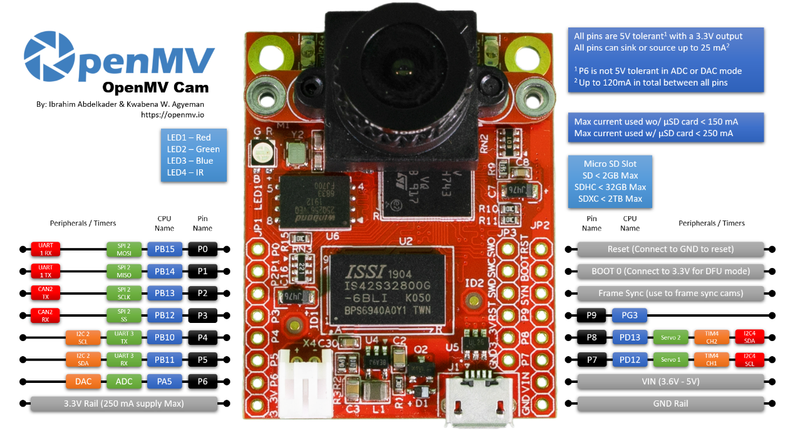
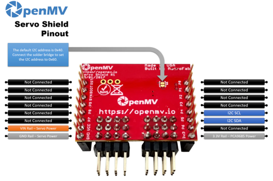
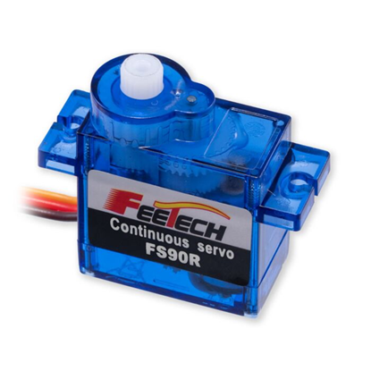

# OpenMV Human-Tracking with Dual-Servo Control -- Technical Document

## I. Project Overview

This project uses an OpenMV development board together with a PCA9685 PWM driver to detect and track an upper-body human target. A Haar-cascade classifier locates the upper body in the video stream, while two servos (pan and tilt) are driven over I²C to steer the camera so that it keeps the target centred.

## II. Main Hardware Modules

- **OpenMV H7 Plus**: Camera/MCU module that performs image processing and runs the tracking script.
- **PCA9685**: 16-channel PWM driver controlled via I²C; drives multiple servos.
- **FS90R Servos (x2)**: One for horizontal (left-right) and one for vertical (up-down) movement of the camera. (Two additional servos can be added for panning and tilting auxiliary lighting.)

## III. Key Functionalities

1. Real-time image capture and processing (grayscale).
2. Haar-cascade detection of the upper body in every frame.
3. Target tracking using Intersection-over-Union (IoU).
4. Dual-servo control adjusts orientation according to the IoU-based error.
5. Servos stop automatically when no target is detected.

## IV. Module Descriptions

### 1. Initialization Module

- Set image format to grayscale (sensor.GRAYSCALE)
- Set resolution to QVGA (320×240)
- Fix white balance and gain to reduce lighting influence on detection
- Initialize the PCA9685 driver with a PWM frequency of 50 Hz

```python
sensor.set_pixformat(sensor.GRAYSCALE)
sensor.set_framesize(sensor.QVGA)
sensor.set_auto_gain(False)
sensor.set_auto_whitebal(False)
```

### 2. Servo Control Function

`set_servo_pulse(channel, pulse_us)`

Sets the PWM output on the specified PCA9685 channel based on the input pulse width, which controls the servo angle.

Typical pulse width values (determined through testing; may vary depending on conditions):

- `STOP_PULSE = 1530`: stop (middle position)
- `FORWARD_PULSE = 1540`: Forward offset (used for rapid rotation in a specific direction)
- `REVERSE_PULSE = 1460`: backward offset
- `SLOW_FORWARD / SLOW_REVERSE`: Slow adjustment, anti-shake

### 3. Human Target Detection and Tracking Logic

*Testing shows that using only the upper-body model yields significantly higher frame rates than combining upper-body and full-body models.*

- Load the Haar upper-body model:
  ```python
  upperbody_cascade = image.HaarCascade("haarcascade_upperbody.cascade", stages=17)
  ```
- This module detects all candidate targets in each frame.
- If a target was being tracked in the previous frame, it uses IoU to match the current detections and continues tracking the most similar one.
- If the target is lost for more than `max_lost_frames`, the system reselects the largest detected region as the new target.

### 4. Servo Deviation Control Logic

Based on the offset between the image center and the target center (x_error, y_error):

- Small deviation → no movement or slow adjustment
- Large deviation → fast adjustment

Deviation threshold parameters:
- `SMALL_ERROR = 15`
- `LARGE_ERROR = 40`

By evaluating the sign and magnitude of the error, the system determines the target's relative position and accordingly adjusts the servo's movement direction and speed.

## V. System Robustness Design

- **Memory Management**: Calls `gc.collect()` every frame to proactively free memory.
- **Exception Handling**: All servo control commands are wrapped in try-except blocks to prevent system crashes due to control failures.
- **Smooth Transition**: Uses a sliding average method to smooth the position of the tracking box and reduce jitter.

```python
alpha = 0.7
x = int(alpha * new_x + (1 - alpha) * last_x)
```

## VI. Main Loop Logic (Simplified Flowchart)

```
loop {
    Capture image → Detect upper-body targets
    ↓
    If previous target exists → Match using IoU
    ↓
    If target found:
        → Compute deviation → Control servos
        → Update previous target coordinates
    Else:
        → Stop servos → Enter idle state
}
```

## VII. Suggestions for Improvement

1. **Support Multi-Target Ranking**: Currently, the system selects the target with the largest area by default. This can be extended to weighted matching based on target recognition, though it may lead to reduced performance.

2. **Replace Haar Model with a CNN Model**: Upgrading to a CNN-based model (e.g., using TensorFlow Lite) can improve detection accuracy and robustness.

3. **Add Debug Serial Output**: Logging target coordinates and servo status over a serial connection can aid in troubleshooting and performance tuning.

## VIII. Important Notes

- **"haarcascade_upperbody.cascade"**: This is a Haar-trained model file converted from an OpenCV cascade using a script. It must be stored on the OpenMV SD card to enable target tracking.

- **OpenMV Firmware Requirements**: The firmware must support I2C communication, Haar cascade detection, PCA9685 control, and operation of two or more FS90R servos.

## IX. Appendix -- Hardware Images and Structures

### Main Camera - OpenMV H7 Plus


### Connection Module - OpenMV Servo Shield Pinout


### FS90R Servo
